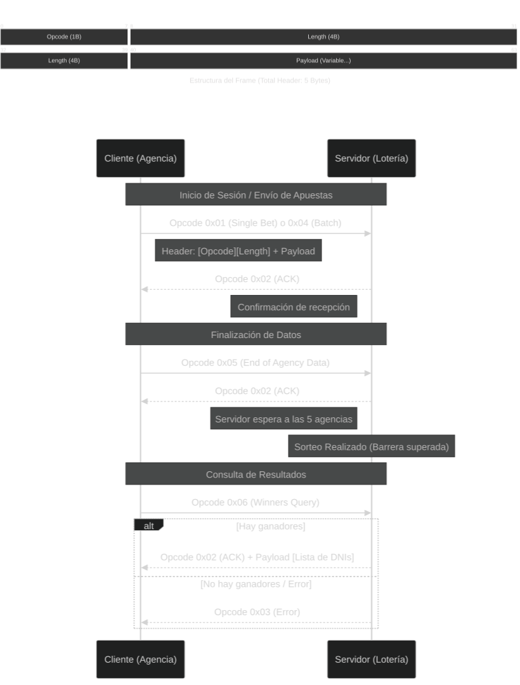

# Resolución TP0

## Parte 1

### Ejercicio 1: Generador de Docker Compose

Creación de un script en Bash que utiliza un bucle seq para crear los contenedores dinámicamente.

**Comando:**

```bash
chmod +x generar-compose.sh
./generar-compose.sh docker-compose-dev.yaml 5
```

### Ejercicio 2: Persistencia con Volúmenes

Ahora se inyectan los archivos de configuración con Docker Volumes y se eliminaron las variables de entorno hardcodeadas ahora definidas mediante los archivos de configuración.

### Ejercicio 3: Validación del Echo Server

Creación de un script en Bash que levanta un contenedor temporal de BusyBox (contenedor liviano con comandos típicos de la shell) conectado a la red del servidor para enviarle un mensaje vía netcat y validar que efectivamente sea un echo server.

**Comando:**

```bash
chmod +x validar-echo-server.sh
./validar-echo-server.sh
```

### Ejercicio 4: Graceful Shutdown

Implementación de manejadores de señales SIGTERM en ambos lenguajes para asegurar el cierre correcto de recursos antes de finalizar los procesos. En Python se cerró el socket para interrumpir el accept() y en Go se utilizó un select con canales para permitir interrupciones inmediatas.

## Parte 2

### Especificación del Protocolo de Comunicación

Se implementó un protocolo binario basado en frames

1. **Header (5 bytes):**
   - Opcode (1 byte): Determina la operación.
   - Payload Length (4 bytes): Tamaño del cuerpo del mensaje.

2. **Tipos de Mensajes (Opcodes):**
   - 0x01: Mensaje de Apuesta (Bet).
   - 0x02: Confirmation (ACK).
   - 0x03: Error.
   - 0x04: Envío de múltiples apuestas serializadas en un único frame (Batch).
   - 0x05: End of Agency Data.
   - 0x06: Winners Query.

### Ejercicio 5 y 6: Procesamiento de Apuestas por Batch

Se implementó la lógica para que los clientes lean los datos desde un archivo `.csv` (montado en los contenedores mediante volúmenes) y envíen las apuestas al servidor. Para optimizar la comunicación, las apuestas se agrupan en _batches_, limitando el tamaño del paquete a un máximo de 8kB y a un `maxAmount` configurable. En el servidor se recibe este batch, se deserializan los registros y se persisten usando `store_bets`. También se manejaron adecuadamente los _short reads_ en la capa de red garantizando la correcta lectura de tamaños de frame dinámicos.

### Ejercicio 7: Sorteo y Consulta de Ganadores

Para el sorteo, los clientes envían un mensaje de fin de datos (`OpcodeEndData`) al agotar sus registros. El servidor lleva la cuenta y, tras recibir la confirmación de las 5 agencias, habilita el sorteo. Posteriormente, los clientes consultan los resultados mediante un mecanismo de polling (`OpcodeGetWinners`). El servidor responde con la lista con los DNIs ganadores correspondientes únicamente a esa agencia.



## Parte 2

### Ejercicio 8: Concurrencia y Sincronización

Se modificó el servidor para soportar múltiples conexiones simultáneas mediante el uso de hilos (multithreading). Se implementó un mecanismo de sincronización basado en un Mutex (`threading.Lock`) para garantizar la consistencia en el acceso a recursos compartidos:

- **Persistencia Segura:** Las escrituras en el archivo de apuestas están protegidas para evitar corrupción de datos por condiciones de carrera.
- **Estado Global:** El contador de agencias finalizadas y el estado del sorteo se manejan de forma atómica para asegurar que el sorteo se dispare exactamente una vez cuando se alcanza la barrera de sincronización.

Además, se incluyeron algunas mejoras adicionales en esta rama que no se ven en las anteriores:

- **Persistencia de conexión:** Hice que se mantenga viva la conexión al momento de mandar batches, así no se interrumpe la conexión entre mensajes.
- **Modularización:** Se modularizaron varias funciones para dejar el código más ordenado.
- **Uso de constantes:** Se reemplazaron magic numbers y valores hardcodeados por constantes.
